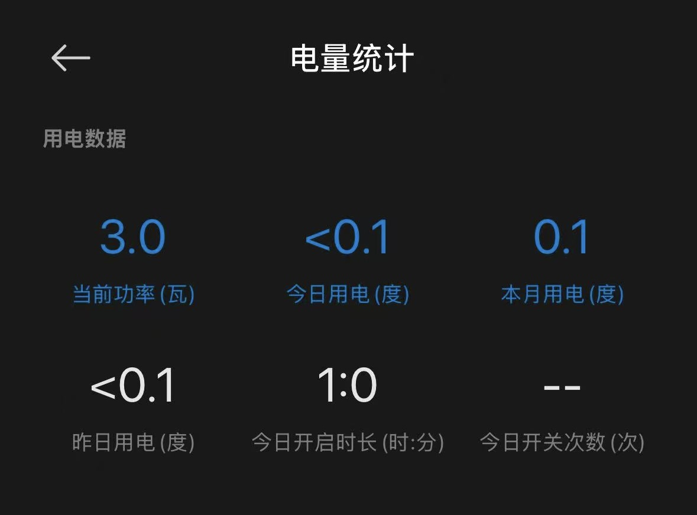
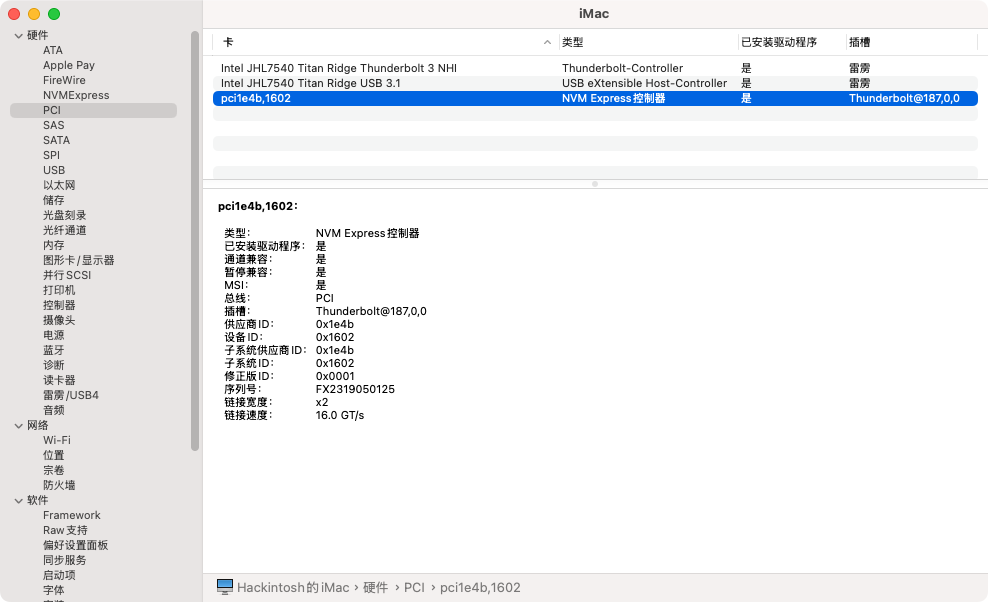

🇨🇳 中文版 | [🇺🇸 English Version](README_en.md)

## NUC9 黑苹果 EFI

✅ 经过测试的系统：macOS 15.6 (24G84)

✅ 接近完美黑苹果

✅ 支持AirDrop隔空投送

✅ 支持接力（跨设备剪切板、iPhone/iPad音频、视频投射到Mac等苹果多设备互联特性）

[前往下载](https://github.com/1257992879/Intel-NUC9-Hackintosh-EFI/releases)

## 电脑配置

**经过测试的系统环境：**

> **Bios Version:** QXCFL579.0077.2024.0801.1718
>
> **macOS系统版本:** macOS 15.6 (24G84)

- 型号：`NUC9i7QNX`（理论上NUC9 i5/i7/i9 通用）
- 处理器：`i7-9750H`
- 内存：32G  `Kingston KF432S201B/16 DDR4 16G 3200MHz`  x2
- 显卡：`Intel UHD Graphics 630`
- 网卡：
  - 无线网卡：`Fenvi FV-T919`
    - (原机 `AX200` 网卡即使驱动了也无法实现 Airdrop ，故这里使用 Fenvi 的网卡)
    - (⚠️ 此 EFI **不带**原机 AX200 网卡的驱动)
  - 有线网卡：
    - `Intel I210`
    - `Intel I219-LM`
- 声卡：`Realtek ALC256`
- 硬盘：`KINGSTON SNV2S500G` 500GB

## 已知问题

#### 雷电

- 只有插着雷电设备开机才能识别并使用雷电设备
- 如果在在系统运行时弹出雷电设备，再插入将无法使用（只有插着雷电设备开机才能使用雷电设备）
- （雷电是公认的黑苹果难点，OC 官方甚至建议主板禁用掉雷电接口以避免一些奇怪的问题，目前能用我已经知足了，除此之外两个Type-C接口能正常使用DisplayPort外接显示器和使用10Gbps的USB）

#### iPad 随航

iPad无线随航不能用（可用有线）

## 使用前必看

> 推荐教程：[国光的黑苹果安装教程：手把手教你配置 OpenCore](https://apple.sqlsec.com/)

### 设置BIOS

- 启动设置
  - 关闭 `Secure Boot` 和 `Fast Boot`
- 视频设置：
  - **强烈建议**将以下选项调整为可以选的最大值：
    -  `Advanced` -> `Video` -> `IGD Minimum Memory`
    -  `Advanced` -> `Video` -> `IGD Aperture Size`
  - 否则当连接高分辨率的显示器或者连接多个显示器开机时会出现开机跑完进度条后黑屏的问题（核显显存不足，开机后再连接高分辨率显示器不会有问题，只会出现在开机时）
  - 如果出现开机跑完进度条后黑屏的问题可以尝试断开多个显示器，只连接一台1080P的显示器
  - 设置完这两项后即使能正常开机，在更新系统时仍有可能出现开机黑屏，这时拔掉多余显示器强制重启即可，建议更新系统时只连接一台显示器

- 安全设置
  - 视情况决定：`BIOS` -> `Security` -> `SecurityFeatures` -> `Intel VT for Directed I/0 (VT-d)`
    - 这个选项是控制虚拟化时硬件直通是否开启的选项
    - 在BIOS中关闭 `VT-d` 或者在 OpenCore 的配置中勾选 `Kernel` -> `Quirks` -> `DisableIoMapper` ，选择其中一个完成即可
    - 如果不做这个操作将会导致当 `AppleVTD` 启用且系统具有 `(a)>16GB内存` 和 `(b)支持的iGPU启用时` 的 WiFi 和以太网无法使用的问题
    - 此 EFI 打开了 `DisableIoMapper` ，所以 BIOS 中可以保持 `VT-d` 启用，以便在多系统中 (如 `PVE` 中)能够使用硬件直通
    - 详情：[https://github.com/CaseySJ/Ventura-AppleVTD-Patch](https://github.com/CaseySJ/Ventura-AppleVTD-Patch)
  - 建议打开：`BIOS` -> `Security` -> `SecurityFeatures` -> `Intel Virtualization Technology`
  - 建议关闭：`BIOS` -> `Security` -> `SecurityFeatures` -> `Intel® Platform Trust Technology`
  - 建议关闭：`BIOS` -> `Security` -> `SecurityFeatures` -> `Intel® Software Guard Extensions (SGX)`

### 安装过程

因为 `Fenvi FV-T919` 网卡在新macOS中已经没有驱动

需要安装完系统后使用 [OpenCore-Legacy-Patcher (OCLP)](https://github.com/dortania/OpenCore-Legacy-Patcher) 来修补驱动

所以安装过程中**没有Wi-Fi和蓝牙**，需要连接网线才有网络

### 安装完系统后

因为 `Fenvi FV-T919` 网卡在新macOS中已经没有驱动，需要安装完系统后使用 [OpenCore-Legacy-Patcher (OCLP)](https://github.com/dortania/OpenCore-Legacy-Patcher) 来修补驱动

1. 前往 [https://github.com/dortania/OpenCore-Legacy-Patcher/releases](https://github.com/dortania/OpenCore-Legacy-Patcher/releases) 下载最新 `OpenCore-Patcher-Uninstaller.pkg`
2. 安装并打开 `OpenCore-Patcher` ，点击 `Post-Install Root Patch` ，再点击 `Start Root Patching` 修补系统
3. 重启，在选择引导磁盘界面按下空格键，选择并进入 `reset NVRAM`，再次重启后进入系统就可以使用Wi-Fi和蓝牙了
4. 每次更新系统或者重新安装系统后都需要使用 `OpenCore-Patcher` 修补一次系统（如果修补完系统后没有删除 `OpenCore-Patcher` 那么它将会在开机后检测是否需要修补，需要修补时会弹窗提醒）

## 成果展示

#### CPU (正常睿频)

#### 显卡

#### 内存

#### 网卡

##### 两个有线网卡

##### Wi-Fi

##### 蓝牙

###### 连接 AirPods

###### 连接 Magic Keyboard

> 在 macOS 中配对后甚至可以在开机时用无线蓝牙进入 BIOS 和选择启动项，在 BIOS 中可用
>
> 不得不说 Magic Keyboard 是有一点 Magic 在身上的

有线连接后自动蓝牙配对可用

电量、名字、图标显示正常

#### 苹果特性

##### iCloud

##### 查找

##### 有线随航

##### 无线/有线 "通用控制"

##### 隔空投送与接力

##### Mac 无线/有线使用 iPhone 的摄像头和麦克风

##### iMessage

##### FaceTime

#### 声卡

#### 休眠

彻底关机后还有2W，开机休眠状态为3W，功率显示精度较差，可认为待机功率在1W左右

#### Hackintool

#### 硬盘

#### 雷电

我连接着 ASM2464 主控的硬盘盒开机后

雷电外接硬盘速度测试

