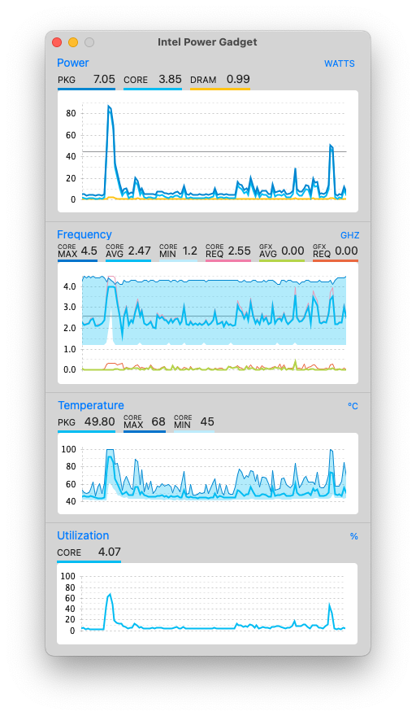
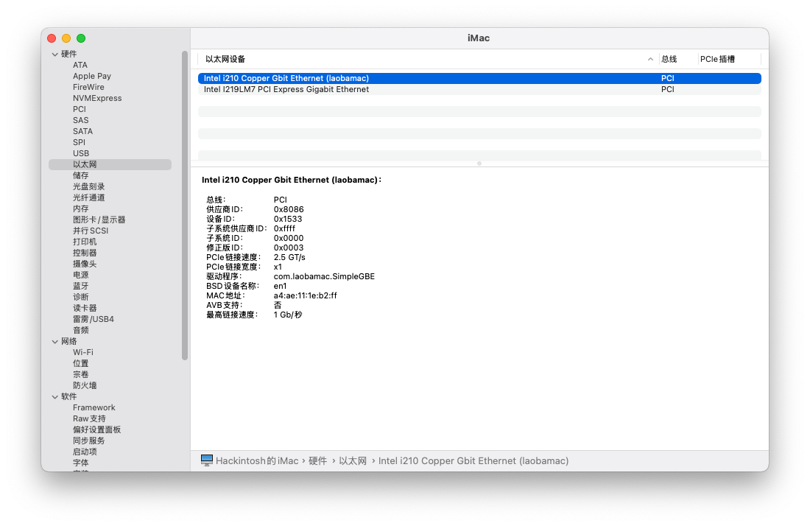
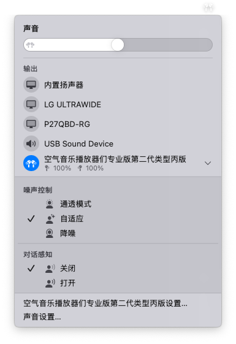
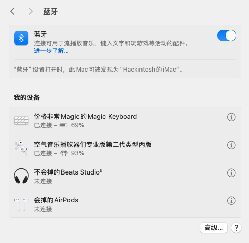
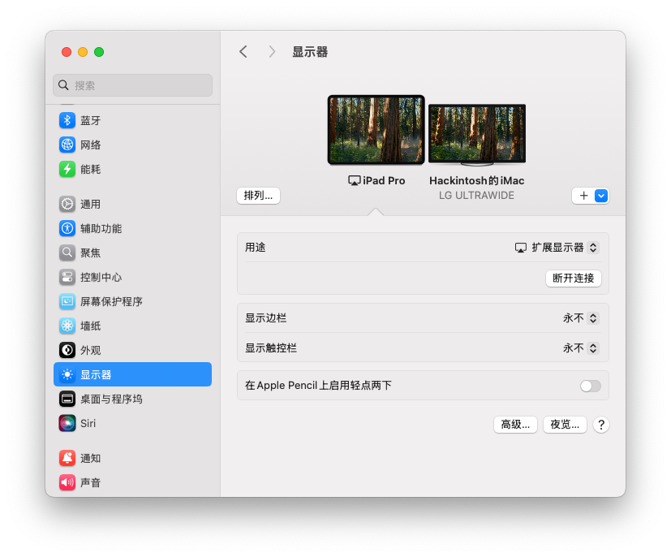
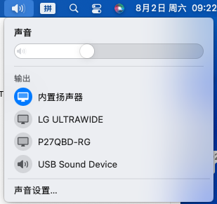
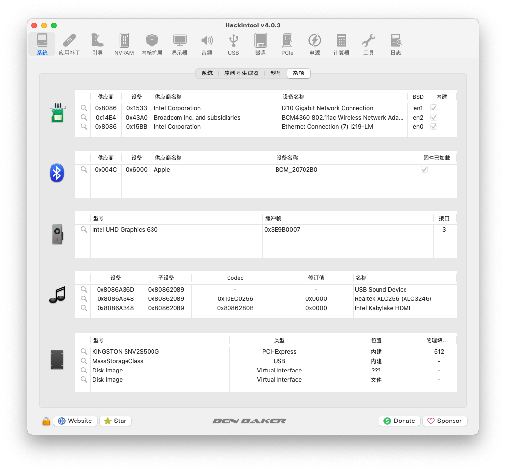

[🇨🇳 中文版](README.md) | 🇺🇸 English Version

## NUC9 Hackintosh EFI

✅ Tested macOS Version: macOS 15.6 (24G84)  
✅ Near-perfect Hackintosh experience  
✅ AirDrop supported  
✅ Continuity supported (Universal Clipboard, iPhone/iPad audio/video casting to Mac, etc.)

[Go to download](https://github.com/1257992879/Intel-NUC9-Hackintosh-EFI/releases)

## System Configuration

**Test Environment:**

> **BIOS Version:** QXCFL579.0077.2024.0801.1718  
> **macOS Version:** macOS 15.6 (24G84)

- Model: `NUC9i7QNX` (Generally compatible with NUC9 i5/i7/i9)
- CPU: `i7-9750H`
- RAM: 32GB `Kingston KF432S201B/16 DDR4 16GB 3200MHz` x2
- GPU: `Intel UHD Graphics 630`
- Network:
  - Wireless: `Fenvi FV-T919`  
    - (The original `AX200` card does not support AirDrop even with drivers; hence replaced with Fenvi)
    - (⚠️ This EFI does **not** include drivers for AX200)
  - Ethernet:
    - `Intel I210`
    - `Intel I219-LM`
- Audio: `Realtek ALC256`
- Storage: `KINGSTON SNV2S500G` 500GB SSD

## Known Issues

### Thunderbolt

- Thunderbolt devices must be connected before boot to be recognized
- Hot-plugging Thunderbolt devices does not work
- (Thunderbolt is a notorious pain point in Hackintosh; even OpenCore suggests disabling it. Current setup supports it at boot. The two Type-C ports work for DisplayPort output and 10Gbps USB.)

### iPad Sidecar

- Wireless Sidecar is not functional (wired mode works)

## Must-Read Before Use

> Recommended Guide: [GuoGuang's OpenCore Hackintosh Installation Tutorial (Chinese)](https://apple.sqlsec.com/)

### BIOS Setup

- Boot:
  - Disable `Secure Boot` and `Fast Boot`
- Video:
  - It is **highly recommended** to maximize these options:
    - `Advanced` -> `Video` -> `IGD Minimum Memory`
    - `Advanced` -> `Video` -> `IGD Aperture Size`
  - Otherwise, connecting high-resolution or multiple monitors at boot may cause black screen (iGPU memory insufficient). Post-boot connections are fine.
  - If black screen occurs after progress bar, try booting with only one 1080P monitor
  - Even with proper settings, black screen may happen during system updates. Disconnect extra monitors and reboot.

- Security:
  - Optional: `BIOS` -> `Security` -> `SecurityFeatures` -> `Intel VT for Directed I/O (VT-d)`
    - Controls passthrough for virtualization
    - Either disable VT-d in BIOS, or enable `DisableIoMapper` under OpenCore -> `Kernel` -> `Quirks`
    - If not configured, enabling AppleVTD with more than 16GB RAM and iGPU may cause Wi-Fi/Ethernet failure
    - This EFI enables `DisableIoMapper`, so VT-d can stay enabled for passthrough in multi-OS setups like PVE
    - Reference: [https://github.com/CaseySJ/Ventura-AppleVTD-Patch](https://github.com/CaseySJ/Ventura-AppleVTD-Patch)
  - Recommended: Enable: `BIOS` -> `Security` -> `SecurityFeatures` -> `Intel Virtualization Technology`
  - Recommended: Disable: `BIOS` -> `Security` -> `SecurityFeatures` -> `Intel® Platform Trust Technology`
  - Recommended: Disable: `BIOS` -> `Security` -> `SecurityFeatures` -> `Intel® Software Guard Extensions (SGX)`

### Installation Notes

The `Fenvi FV-T919` card is no longer natively supported in new macOS versions.  
**Wi-Fi and Bluetooth are unavailable during installation**. Connect via Ethernet.  
After installation, use [OpenCore-Legacy-Patcher (OCLP)](https://github.com/dortania/OpenCore-Legacy-Patcher) to patch drivers.

### Post-Installation

The `Fenvi FV-T919` card is no longer natively supported in new macOS versions.

After installation, use [OpenCore-Legacy-Patcher (OCLP)](https://github.com/dortania/OpenCore-Legacy-Patcher) to patch drivers.

1. Download the latest `OpenCore-Patcher-Uninstaller.pkg` from [https://github.com/dortania/OpenCore-Legacy-Patcher/releases](https://github.com/dortania/OpenCore-Legacy-Patcher/releases)
2. Install and open `OpenCore-Patcher`, click `Post-Install Root Patch`, then `Start Root Patching`
3. Reboot, press spacebar at boot menu, select `reset NVRAM`, then reboot into macOS
4. Repeat this patching after every system update or reinstallation  
   (If `OpenCore-Patcher` is not removed, it will auto-remind you on boot if patching is needed)

## Showcase

### CPU (Turbo Boost Working)

### GPU

### Memory

### Network

#### Dual Ethernet Cards

#### Wi-Fi

#### Bluetooth

##### AirPods Connected

##### Magic Keyboard Connected

> Once paired in macOS, the Magic Keyboard even works in BIOS and boot selection menu  
> Definitely some “Magic” in that name

Automatically paired after wired connection:

Battery, name, icon shown correctly:

### Apple Ecosystem Features

#### iCloud

#### Find My

#### Wired Sidecar

#### Universal Control (Wireless/Wired)

#### AirDrop & Continuity

  

#### Mac using iPhone camera & mic (Wireless/Wired)

#### iMessage

#### FaceTime

  

---

### Audio

  

---

### Sleep

2W after full shutdown; 3W during sleep; estimated idle power around 1W due to sensor inaccuracy

### Hackintool

  

### Storage

### Thunderbolt

Booting with ASM2464 enclosure connected:

Thunderbolt external SSD speed test:

